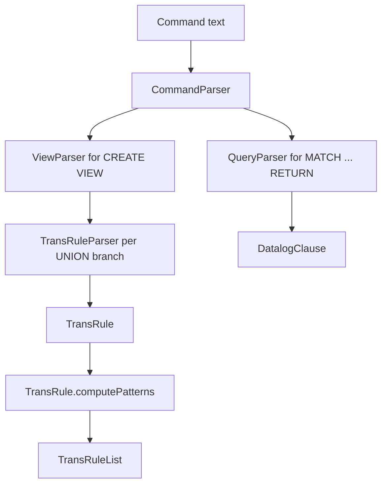

# Guide 1: GQL and View Language Specification

This manual describes the graph language supported by pg-view and connects each language feature to the source code that parses it. The language is deliberately small: it borrows Cypher/GQL path syntax, then adds transformation-view constructs that can copy, delete, merge, and create graph objects.

The authoritative grammar is `src/main/antlr4/edu/upenn/cis/db/graphtrans/GraphQueryParser/GraphTransQuery.g4`. ANTLR generates the lexer/parser classes used by the Java visitors in `src/main/java/edu/upenn/cis/db/graphtrans/parser/`.

## 1. Command Model

The console is driven by `Client.main`, `CommandExecutor.readCommand`, and `CommandParser`. Commands are semicolon-terminated and are parsed by the top-level `cmd` grammar rule.

Common commands:

```gql
connect pg;
create graph demo;
use demo;
create schema node Entity;
create schema edge LINKED_TO (Entity -> Entity);
insert N (1, "Entity");
import E_g from "edges.csv";
CREATE virtual VIEW v ON g WITH DEFAULT MAP (
  MATCH (a:Entity)-[e:LINKED_TO]->(b:Entity)
  CONSTRUCT (a:Entity)-[e:LINKED_TO]->(b:Entity)
);
MATCH (a:Entity)-[:LINKED_TO]->(b:Entity) FROM v RETURN (a), (b);
create ssr on v;
```

Important source locations:

- `parser/CommandParser.java` dispatches grammar events to `CommandExecutor`.
- `CommandExecutor.connect` creates the selected `Store`.
- `CommandExecutor.createGraph` initializes the base graph relations using `BaseRuleGen.addRule`.
- `CommandExecutor.createView` type-checks, compiles, and installs a view.
- `CommandExecutor.query` runs the query rewriting and execution path.

## 2. Base Graph Data Model

The core graph model is encoded in four relations. `Config.initialize` creates the predicate signatures, and `BaseRuleGen.getBaseGraphRuleBaseEDB(false)` creates the base relation declarations:

```text
N_g(id, label)
E_g(id, from, to, label)
NP_g(id, property, value)
EP_g(id, property, value)
```

All node and edge ids are currently integer/long ids. Property values are strings in the base graph abstraction. Backends may store the data in SQL tables, LogicBlox predicates, Neo4j, or an in-memory simple Datalog engine, but the Datalog layer reasons over these four logical relations.

Schema commands populate catalog relations and in-memory schema objects:

- `create schema node Label` calls `CommandExecutor.addSchemaNode` and inserts into `N_schema`.
- `create schema edge Label (From -> To)` calls `CommandExecutor.addSchemaEdge` and inserts into `E_schema`.
- `add constraint ...` records EGDs for type checking.

## 3. User Query Language

A user query has the shape:

```gql
MATCH <patterns>
[FROM <graph_or_view>]
[WHERE <conditions>]
RETURN <variables_or_paths>
```

Examples:

```gql
MATCH (a:Entity)-[r:LINKED_TO]->(b:Entity)
WHERE a.name = "aspirin" AND r.type = "citation"
RETURN (a), (b);

MATCH (e:Entity)-[sim:<=> {threshold: 0.8}]->(t:Tag)
RETURN (e), (t);
```

`QueryParser.Parse` converts this text into a `DatalogClause`:

- Node patterns become `N(var, "Label")`.
- Edge patterns become `E(edge, src, dst, "Label")`.
- Node property predicates become `NP(var, "prop", prop_value)` plus interpreted comparisons.
- Edge property predicates become `EP(edge, "prop", prop_value)` plus interpreted comparisons.
- A `FROM v` clause suffixes non-interpreted relations with `_v`, so `N(a, "Entity")` becomes `N_v(a, "Entity")`.
- Similarity edges become `SIM_EDGE(edge, src, dst, "<=>", threshold)`.
- Function calls in `WHERE` become function atoms whose last term is a generated return variable.

The current `RETURN` implementation returns variables, not full property objects. The parser collects return node and edge variables into the query head relation named `_`, using `Config.relname_query`.

## 4. View Definition Language

The view grammar is:

```antlr
create_view
  : 'CREATE' view_type? 'VIEW' view_name view_base? with_default?
    '(' view_definition ')';

view_type
  : 'virtual' | 'materialized' | 'hybrid' | 'asr';

with_default
  : 'WITH DEFAULT MAP';

view_definition
  : trans_rule ('UNION' trans_rule)*;
```

A transformation rule has this order:

```gql
MATCH <input_pattern>
[WHERE <conditions>]
[CONSTRUCT <output_pattern>]
[MAP FROM <input_vars> TO <new_output_var>]*
[SET <var> = SK("<name>", <vars...>)]*
[DELETE <matched_vars>]
```

That order matters because `TransRuleParser` expects the grammar order above.

### 4.1 `MATCH`

`MATCH` binds variables over the input graph. In a view, `TransRuleParser.visitMatch_clause` records:

- `patternMatch`: atoms used to evaluate the rule body.
- `patternBefore`: atoms used by type checking and index construction.
- `matchNodeVars` and `matchEdgeVars`: variables known to be existing input objects.
- `nodeVarToLabelMap`: label constraints needed by later clauses.

Anonymous `_` variables are converted to generated internal variables such as `_a0`.

### 4.2 `WHERE`

`WHERE` supports interpreted comparisons:

```text
=, >, <, >=, <=, !=
```

Property access is normalized through `ParserHelper.processWhereClause`. For example:

```gql
WHERE a.name = "PubMed" AND e.weight > "5"
```

becomes:

```text
NP(a, "name", a_name_val), a_name_val = "PubMed",
EP(e, "weight", e_weight_val), e_weight_val > "5"
```

`IN` and array syntax are present in the grammar but are not implemented in `TransRuleParser`.

### 4.3 `CONSTRUCT`

`CONSTRUCT` declares the output graph pattern produced by a rule. `TransRuleParser.visitConstruct_clause` separates:

- `patternConstruct`: all output atoms.
- `patternAdd`: output atoms whose object id variable was not present in `MATCH`.
- `newNodeVars` and `newEdgeVars`: constructed object variables that require deterministic ids.

Every constructed node and edge must have an explicit label. Reusing an existing matched variable means the view can keep that object's id unless a mapping or Skolem term changes it.

### 4.4 `SET` and Skolem Ids

New objects need deterministic identities. The grammar supports:

```gql
SET merged = SK("mergeEntity", a, b)
```

`TransRuleParser.visitWhere_condition` stores this in `TransRule.getSkolemFunctionMap()` as:

```text
merged -> ["mergeEntity", a, b]
```

`ViewRule` later emits `GENNEWID_*` predicates around this map. LogicBlox gets constructor metadata through `DatalogProgram.addConstructorForLB`; PostgreSQL can compile generated ids to calls such as `GENNEWID_CONST(...)` in `PostgresStore.handleHeadAtom`.

### 4.5 `MAP FROM ... TO ...`

`MAP FROM a, b TO merged` says that input nodes are represented by a constructed output node. This is essential for transformation views with default copy behavior. `TransRuleParser.visitMap_clause` validates that the target is a new constructed node or edge, then records:

```text
merged -> [a, b]
```

`ViewRule.addMapRules` uses this information to emit `MAP_<view>(src, dst)` rules.

### 4.6 `DELETE`

`DELETE a, e` is only legal for variables bound in `MATCH`. `TransRuleParser.visitRemove_clause` classifies the variables into:

- `nodeVarsToDelete`
- `edgeVarsToDelete`

`ViewRule.addAddRemoveRules` emits `N_deleted_<view>` and `E_deleted_<view>` rules. These relations are used by default mapping to avoid copying deleted objects.

### 4.7 `WITH DEFAULT MAP`

Without `WITH DEFAULT MAP`, a view contains only what explicit rules construct. With `WITH DEFAULT MAP`, `ViewRule.addViewRules` also copies unmapped and undeleted base nodes, creates `DMAP_<view>` identity mappings, and copies edges after remapping their endpoints through `DMAP`.

This is the feature that makes localized transformation views practical: a rule can rewrite a small subgraph while leaving the rest of the input graph visible.

## 5. Parser Control Flow



Key classes:

- `ViewParser.Parse` extracts the view name, base name, type, default-map flag, and rule substrings.
- `TransRuleParser.Parse` parses each rule and fills `TransRule`.
- `TransRule.computePatterns` derives affected and after-pattern information used by indexes and type checking.
- `QueryParser.Parse` produces the Datalog query clause used by rewriting.

## 6. Similarity Syntax

The grammar includes early support for multi-step reasoning queries that combine structured joins, exact predicates, and vector similarity predicates:

```antlr
SIM_OP : '<=>' | '<->' | '<+>';
edge_term_body
  : var? (':' (labelRegEx | star))? properties?
  | var? ':' SIM_OP properties?;
funcCall : ID ('.' ID)* '(' funcArg (',' funcArg)* ')';
```

Current behavior:

- `<=>` is compiled as a cosine-similarity style edge predicate in mapped SQL compilation.
- `<->` is compiled as an L2-distance style predicate.
- `<+>` is parsed but does not have distinct SQL semantics beyond the fallback distance branch.
- UDF calls such as `cosine_similarity(e.detail, "query", "gemini")` are parsed into Datalog atoms and compiled only in the mapped-table SQL path.

See Guide 6 for the vector-specific details.
