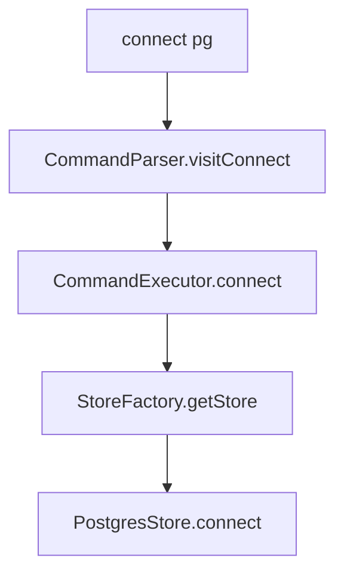

# Guide 2: DBMS Connection and Schema Mapping

This manual explains how pg-view connects to storage engines and how it maps between logical property graph atoms and physical relational tables. Developers should keep two storage models separate:

1. The native pg-view graph-relational model: `N_g`, `E_g`, `NP_g`, and `EP_g`.
2. The newer physical-schema mapping model: logical node/edge labels are compiled directly to application tables such as `entities`, `entity_link`, and `entity_tags`.

The first model is the main system used by graph views. The second model supports similarity and LLM-style multi-step reasoning queries over application-specific relational schemas.

## 1. Store Abstraction

All backends implement `src/main/java/edu/upenn/cis/db/graphtrans/store/Store.java`.

Important methods:

```java
boolean connect();
void disconnect();
void createSchema(String dbname, Predicate p);
void createView(String name, List<DatalogClause> cs, boolean isMaterialized);
void createView(DatalogProgram p, TransRuleList transRuleList);
StoreResultSet getQueryResult(List<DatalogClause> cs);
void addTuple(String rel, ArrayList<SimpleTerm> tuple);
long importFromCSV(String relName, String filePath);
```

`StoreFactory.getStore` maps platform names to implementations:

| Platform | Store class | Notes |
| --- | --- | --- |
| `lb` | `LogicBloxStore` | Original Datalog-native backend. |
| `pg` | `PostgresStore` | SQL backend over PostgreSQL. |
| `dd`, `duckdb` | `DuckDBStore` | Embedded DuckDB backend. |
| `n4` | `Neo4jStore` | Neo4j execution path, mostly for comparison and graph-native execution. |
| `sd` | `SimpleDatalogStore` | In-memory simple Datalog engine used as a base/canonical store and for tests. |

The console path is:



`Config.load("conf/graphview.conf")` reads INI settings with `ini4j`. PostgreSQL uses `postgres.ip`, `postgres.port`, `postgres.username`, and `postgres.password`; DuckDB uses `duckdb.database` if present.

## 2. Native Base Graph Relations

`CommandExecutor.createGraph` clears the in-memory schema, calls `BaseRuleGen.addRule`, and asks the store to create all base and catalog predicates.

Core graph predicates:

```text
N_g(id, label)
E_g(id, from, to, label)
NP_g(id, property, value)
EP_g(id, property, value)
```

Catalog predicates:

```text
N_schema(label)
E_schema(from, to, label)
EGD(constraint)
CATALOG_VIEW(name, base, type, rule, level)
CATALOG_INDEX(viewname, type, label)
CATALOG_SINDEX(viewname, query)
```

In PostgreSQL, `PostgresStore.createSchema` creates generic columns named `_0`, `_1`, and so on. For `N_g` and `E_g`, it also creates single-column B-tree indexes on each column through `addTableIndex`.

For example, `N_g(id, label)` becomes roughly:

```sql
CREATE TABLE IF NOT EXISTS N_g (
  _0 INT DEFAULT 0,
  _1 VARCHAR(1024)
);
CREATE INDEX N_g___0 ON N_g (_0);
CREATE INDEX N_g___1 ON N_g (_1);
```

This generic column layout is important because the Datalog-to-SQL compiler does not depend on domain-specific table names in the native path.

## 3. Physical Schema Mapping

The mapped-table path is centered on:

- `src/main/java/edu/upenn/cis/db/graphtrans/catalog/SchemaMapping.java`
- `schema_mapping.yaml`
- `PostgresStore.getSqlForDatalogClauseWithMapping`
- `DuckDBStore.getSqlForDatalogClause`, which delegates mapped compilation to `PostgresStore` with dialect `duckdb`

The mapping file describes how a logical graph label maps to existing relational tables and columns:

```yaml
version: "1.0"
target_dialect: postgresql

nodes:
  Entity:
    table: entities
    primary_key: entity_id
    default_embedding: gemini_detail
    properties:
      id: entity_id
      name: entity_name
      detail:
        column: entity_detail
        embedding:
          column: entity_embed
          dimension: 1536
          model: text-embedding-3-small

edges:
  LINKED_TO:
    table: entity_link
    source:
      node: Entity
      key: from_id
      ref_key: entity_id
    target:
      node: Entity
      key: to_id
      ref_key: entity_id
    properties:
      type: link_type
```

The mapping loader is not currently wired into the CLI. The test path does this explicitly:

```java
SchemaMapping mapping = SchemaMapping.load("schema_mapping.yaml");
Config.setSchemaMapping(mapping);
```

After that, `PostgresStore.getSqlForDatalogClause` detects `Config.getSchemaMapping() != null` and uses mapped compilation instead of the generic `_0`, `_1` native-relation compiler.

## 4. Mapping Nodes

In the logical Datalog clause:

```text
N(e, "Entity")
```

`PostgresStore.getSqlForDatalogClauseWithMapping` records:

```text
e -> Entity
```

Then it adds:

```sql
entities AS e
```

to the SQL `FROM` list. If the query returns `e`, the compiler projects the primary key from the mapping:

```sql
e.entity_id AS _0
```

Property atoms are compiled by looking up the node label and property:

```text
NP(e, "name", e_name_val)
e_name_val = "aspirin"
```

becomes:

```sql
e.entity_name = 'aspirin'
```

The implementation first builds `varToNodeLabel`, then `varToColumnExpr`, so later interpreted atoms can substitute property-value variables with physical column references.

## 5. Mapping Edges

The logical edge atom:

```text
E(r, src, dst, "LINKED_TO")
```

uses the `edges.LINKED_TO` mapping.

For a separate edge table, the compiler adds the edge table alias and source/target join predicates:

```sql
entity_link AS r
r.from_id = src.entity_id
r.to_id = dst.entity_id
```

For an inline/self-join edge such as `PARENT_OF`, where the edge table is the same as the source and target node table, no separate edge alias is added. Instead, the compiler emits a direct node-table join condition. The test `EmbeddingExtensionsTest.testSelfJoinParentOf` checks for:

```sql
child.entity_parent = parent.entity_id
```

This is useful for foreign-key relationships that are not stored as separate edge rows.

Edge properties work the same way as node properties:

```text
EP(citation, "type", citation_type_val)
citation_type_val = "citation"
```

becomes:

```sql
citation.link_type = 'citation'
```

## 6. Vector and Text-Derived Mapping

The mapped-table path can combine structured attributes, vector similarity, and exact joins. pg-view's mapping layer contains the pieces needed to compile this kind of query over local relational tables.

`SchemaMapping.getEmbedding(nodeLabel, propName, modelName)` resolves embedding columns in this order:

1. If a model name is supplied, search mapped properties whose embedding model or property key matches it.
2. If a property is supplied, use that property's `embedding` block.
3. Use the node's `default_embedding`.
4. Use the first property with an embedding block.

`SchemaMapping.getPathQueryOverride(sourceLabel, targetLabel)` supports pair-specific embedding choices:

```yaml
path_query_overrides:
  - source: Entity
    target: Tag
    source_embedding: detail
    target_embedding: gemini_value
```

This lets a similarity edge between `Entity` and `Tag` compare `Entity.detail` embeddings against `Tag.gemini_value` embeddings, rather than blindly using both defaults.

## 7. Backend SQL Dialects

`PostgresStore.getSqlForDatalogClauseWithMapping` has dialect branches:

PostgreSQL:

```sql
1 - (src.embedding <=> dst.embedding) > threshold
src.embedding <-> dst.embedding < threshold
```

DuckDB:

```sql
array_cosine_similarity(src.embedding, dst.embedding) > threshold
array_distance(src.embedding, dst.embedding) < threshold
```

Function-call similarity is compiled similarly. A Datalog atom such as:

```text
cosine_similarity(e_detail_val, "vaccine side effects", "gemini", f_0)
f_0 > 0.85
```

can compile to:

```sql
1 - (e.gem_embed <=> get_embedding('vaccine side effects')) > 0.85
```

The repository assumes a database-visible `get_embedding(...)` function for this generated SQL; it does not implement the embedding service itself.

## 8. Developer Checklist

When adding a backend or mapping feature:

- Update `StoreFactory` if a new store type is introduced.
- Implement both `createView(DatalogProgram, TransRuleList)` and `getQueryResult(List<DatalogClause>)`.
- Preserve generic Datalog semantics over `N/E/NP/EP` unless the feature is explicitly mapped-table only.
- If adding mapped-table behavior, update `SchemaMapping` and `PostgresStore.getSqlForDatalogClauseWithMapping`.
- Add parser coverage in `QueryParser` only if the feature can be represented as Datalog atoms.
- Add tests similar to `EmbeddingExtensionsTest`, which inspect generated SQL without requiring a live database.
