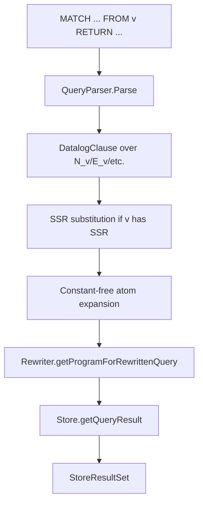

# Guide 4: Query Rewriting and Unfolding

This manual follows a user query from GQL text to executable backend query. The central idea is that a query over a virtual view mentions IDB predicates such as `N_v` and `E_v`; pg-view rewrites those predicates until the query is expressed over base EDBs, materialized intermediates, UDFs, and interpreted predicates.

Primary source files:

- `parser/QueryParser.java`
- `graphtrans/CommandExecutor.java`
- `datalog/QueryRewriterSubstitution.java`
- `datalog/rewriter/Rewriter.java`
- `datalog/rewriter/Handler.java`
- `datalog/rewriter/Unfolder.java`
- `graphtrans/store/postgres/PostgresStore.java`

## 1. End-to-End Query Path

`CommandExecutor.query` is the top-level method for non-Neo4j backends:



The Neo4j path is special: `CommandExecutor.queryInNeo4j` sends the original query string to `Neo4jStore.getQueryResult(String)`.

## 2. Query Parsing

`QueryParser.Parse` visits the grammar rule `user_query`:

```antlr
user_query
  : match_clause from_clause? where_clause? return_clause;
```

For:

```gql
MATCH (a:Entity)-[r:LINKED_TO]->(b:Entity)
FROM v
WHERE a.name = "aspirin"
RETURN (a), (b)
```

the parser builds a Datalog clause like:

```text
_(a, b) <-
  E_v(r, a, b, "LINKED_TO"),
  N_v(a, "Entity"),
  N_v(b, "Entity"),
  NP_v(a, "name", a_name_val),
  a_name_val = "aspirin".
```

Implementation details:

- `visitMatch_clause` creates `N`, `E`, and `SIM_EDGE` atoms.
- `parseNodeProperties` and `parseEdgeProperties` turn inline `{prop: value}` syntax into property atoms and equality predicates.
- `visitWhere_condition` supports property references, function calls, and interpreted comparisons.
- `visitFrom_clause` records the source graph/view name.
- After visiting the tree, `Parse` suffixes every non-interpreted relation with `_<from>` if a `FROM` clause exists.

If `FROM` is omitted, `from` remains unset in the parser. In practice, most view queries should include `FROM`; base graph queries may use `FROM g`.

## 3. SSR Substitution Before Unfolding

`CommandExecutor.getQueryRewriting` checks whether the `FROM` view has an SSR index:

```java
TransRuleList tr = GraphTransServer.getTransRuleList(from);
if (tr.getIndexType() == IndexType.SSR) {
    newQuery = QueryRewriterSubstitution.rewrite(q, tr.getIndexRuleList());
}
```

`QueryRewriterSubstitution` tries to replace subgraphs in the query body with materialized `INDEX_<view>_<rule>` relations. Its algorithm is:

1. Create a canonical database from the query body in a temporary workspace named `_QUERY_REWRITER`.
2. For each SSR rewriting rule, evaluate the rule over the canonical database.
3. Mark body atoms covered by a successful rule match.
4. Insert the corresponding `INDEX_*` atom into the rewritten query body.
5. Copy uncovered atoms unchanged.
6. If uncovered property atoms refer to a variable covered by an SSR, rewrite them to SSR property relations such as `INDEX_v_0_NP`.

This is a syntactic and canonical-database based substitution step. It happens before general Datalog unfolding.

## 4. Constant-Free Atom Expansion

`CommandExecutor.getQueryRewritingConstantFreeAtoms` calls `Atom.getAtomBodyStrWithInterpretedAtoms("")` for each body atom. This normalizes constants out of relation atoms.

For example:

```text
N_v(a, "Entity")
```

can become:

```text
N_v(a, a_label), a_label = "Entity"
```

This keeps the unfolding logic centered on variable-to-variable substitution. Constants are represented as interpreted predicates.

## 5. Rewriter Entry Point

`Rewriter.getProgramForRewrittenQuery(program, query)` creates a fresh `DatalogProgram` and calls:

```java
HashSet<Atom> rwBody = getRewrittenBody(headVars, body);
```

`getRewrittenBody` runs three phases:

```java
Handler.handleAllPositiveIDBs(headVars, rwBody);
Handler.handleAllUDFs(headVars, rwBody);
Handler.handleAllNegativeIDBs(headVars, rwBody);
Helper.integrityCheckBody(rwBody);
```

The final body is wrapped in a query rule:

```text
_(headVars...) <- rewritten_body.
```

The rewritten program may also contain auxiliary subquery rules created during disjunctive and negation handling.

## 6. Positive IDB Unfolding

An IDB is any non-interpreted atom whose relation is not in the original program's EDB set, not in the rewritten program's EDB set, and not a registered UDF.

`Handler.selectPositiveIDBAtom` chooses one positive IDB from the body. Then:

- If the program has one rule for that relation, `Unfolder.unfoldSingleQuery` replaces the atom directly.
- If the program has multiple rules, `Unfolder.unfoldDisjunctiveQuery` creates a new auxiliary relation for the disjunction.

### 6.1 Single-Rule Unfolding

`Unfolder.unfoldAtom(unfoldingHead, rule)` does the core work:

1. Compare the rule head with the query atom position by position.
2. Map each rule-head variable to the corresponding query variable.
3. Assign fresh variables to body variables that do not appear in the head.
4. Clone each rule body atom and substitute variables.
5. If one rule variable maps to multiple query variables, add equality atoms.
6. Run `Helper.integrityCheckBody`; if it fails, return an empty unfolding.

Example:

```text
N_v(x, l) <- N_g(x, l), not N_deleted_v(x).

Query atom:
N_v(a, "Entity")
```

After constant normalization and unfolding:

```text
N_g(a, a_label),
a_label = "Entity",
not N_deleted_v(a)
```

The negated atom is handled later.

### 6.2 Disjunctive Unfolding

A view relation often has multiple defining rules because multiple transformation rules can construct the same output relation. Naively unfolding all alternatives into the outer query can cause combinatorial growth.

`Unfolder.unfoldDisjunctiveQuery` creates an auxiliary relation named like:

```text
_NEWPRED_DISJUNCTIVE_UNFOLDED_N_v(...)
```

For each defining rule, it:

- Unfolds the picked atom.
- Adds atoms related to the picked atom as a subquery context.
- Recursively rewrites that subquery body.
- Adds one auxiliary rule for that alternative.

The outer query then references the auxiliary relation rather than expanding every disjunct inline.

## 7. UDF Handling

Generated-id predicates are represented as UDF-like atoms named:

```text
GENNEWID_MAP_<view>_<skolemName>(args..., generatedId)
```

`Handler.handleAllUDFs` looks for atoms whose relation starts with `GENNEWID_`. It builds constructor rules that produce:

```text
GENNEWID_CONST_<view>_<skolemName>(args..., generatedId_newobj)
GENNEWID_<view>(generatedId_newobj)
```

guarded by the positive EDB context that determines the arguments. This makes generated ids materializable and queryable while preserving deterministic Skolem semantics.

## 8. Negative IDB Handling

Default-map views introduce negation:

```text
not MAP_v(id, _)
not N_deleted_v(id)
not E_deleted_v(id)
```

If a negated atom is not already an EDB/materialized relation, `Handler.handleAllNegativeIDBs` rewrites it into a bounded anti-join pattern.

For a body like:

```text
A(a, b), not B(a, b), C(c)
```

the handler creates:

```text
R_bound(a, b) <- A(a, b)
R_neg_pos(a, b) <- R_bound(a, b), B(a, b)
R_neg_handled(a, b) <- R_bound(a, b), not R_neg_pos(a, b)
```

and replaces the original related atoms plus `not B` with `R_neg_handled`.

The goal is to ensure negation is evaluated only over variables bound by positive context. This is essential for SQL translation, where unbound negation would become unsafe or semantically ambiguous.

## 9. Backend SQL Compilation

After rewriting, `CommandExecutor.executeQueryProgram` collects rules from the rewritten program and calls:

```java
store.getQueryResult(cs)
```

In `PostgresStore`:

- `getSqlForDatalogClause` compiles native Datalog over generic `_0`, `_1`, ... columns.
- Positive atoms become table aliases `R0`, `R1`, ...
- Shared variables become equality predicates.
- Constants and interpreted atoms become SQL `WHERE` predicates.
- Negated atoms become `LEFT JOIN` fragments with null/non-null tests.
- Generated-id atoms can compile to `GENNEWID_CONST(...)` expressions.

In mapped-table mode, `getSqlForDatalogClause` delegates to `getSqlForDatalogClauseWithMapping`, which uses `SchemaMapping` to emit SQL over application tables and embedding columns.

DuckDB's `getSqlForDatalogClause` delegates mapped compilation to `PostgresStore` with dialect `duckdb`, then executes the SQL over a JDBC DuckDB connection.

## 10. Debugging Rewrites

Useful places to inspect:

- `program;` in the console prints `GraphTransServer.getProgram()`.
- `CommandExecutor.getQueryRewriting` prints `newQuery`.
- `PostgresStore.getSqlForDatalogClause` prints the Datalog clause and generated SQL in several debug statements.
- `DatalogProgram.getHeadRules()` tells which auxiliary rules will be executed.

Common failure modes:

- A query relation has no rule: the view was not created, or the relation name was suffixed with the wrong `FROM` view.
- Too many rules: `CommandExecutor.query` stops if the rewritten rule count exceeds 10,000.
- Unsafe negation: a negated atom cannot be related to positive bound atoms.
- Mapping mode returns bad SQL: `Config.getSchemaMapping()` is set, but the YAML does not define a node/edge label or property used by the query.
