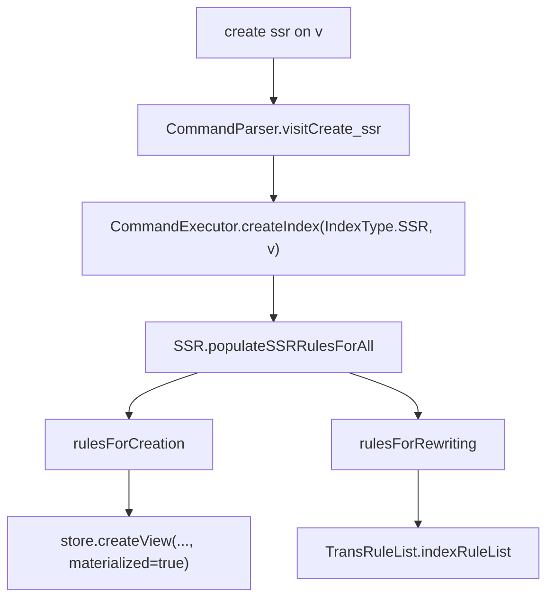

# Guide 5: Indexing and Optimizations

This manual covers the index mechanisms in pg-view. The implemented index path in this repository is SSR, or Subgraph Substitution Relations. ASR and semantic-join materialization are useful architectural directions, but they are not exposed with the same level of implementation.

Primary source files:

- `graphtrans/CommandExecutor.java`
- `datalog/SSR.java`
- `datalog/SSRHelper.java`
- `datalog/QueryRewriterSubstitution.java`
- `datalog/rewriter/Rewriter.java`
- `graphtrans/store/postgres/PostgresStore.java`

## 1. View Execution Spectrum

pg-view supports several strategies for views and intermediates:

| Strategy | Main idea | Implementation status |
| --- | --- | --- |
| Virtual view | Keep Datalog definitions and unfold query-time IDBs. | Implemented through `Rewriter`. |
| Materialized view | Store output and intermediate relations. | Implemented through store-specific `createView`. |
| Hybrid view | Materialize selected match/mapping intermediates. | Partially implemented via `viewType = hybrid`. |
| ASR | Materialize access-support matches for a pattern body. | Conceptual and grammar-level support; user-facing command is not wired. |
| SSR | Materialize enough input/output bindings to substitute transformed subgraphs. | Implemented through `create ssr on <view>`. |
| Semantic-join materialization | Materialize vector-similarity join pairs for multi-step reasoning. | Architectural direction only; not implemented as a class in this repo. |

The main query-time optimizer in this codebase is not a cost-based optimizer. It is a rule rewriting pipeline plus optional SSR substitution.

## 2. SSR: What It Stores

An SSR relation captures the relationship between:

- input variables matched by a transformation rule;
- generated output variables such as Skolemized nodes or edges;
- enough projected variables to answer a matching output subgraph query.

For a view `v` and rule index `i`, SSR relations are named:

```text
INDEX_v_i(...)
INDEX_v_i_NP(...)
INDEX_v_i_EP(...)
```

The exact arity is rule-dependent. `SSR.createSSRForNewVariable` and `SSR.populateSSRRules` build both creation rules and rewriting rules.

Conceptually:

```text
INDEX_v_i(inputVars..., generatedVars...) <-
  MATCH pattern over base graph,
  GENNEWID_MAP_v_...(args..., generatedVar).
```

The rewriting rule has the inverse flavor:

```text
INDEX_v_i(projectedVars...) <-
  output pattern over N_v/E_v/NP_v/EP_v.
```

That rewriting rule lets the query rewriter recognize a subgraph query over the view and replace it with the index relation.

## 3. Creating an SSR

The user-facing command is:

```gql
create ssr on v;
```

The path is:



`CommandExecutor.createIndex` also marks the view's `TransRuleList` with `IndexType.SSR`. Later, `CommandExecutor.getQueryRewriting` checks this flag before unfolding.

## 4. SSR Rule Generation

`SSR.populateSSRRulesForAll` has two major branches:

### 4.1 Views Without Default Map

For non-default-map views, the current implementation creates a direct index over the first rule's match pattern:

```text
INDEX_v(...) <- pattern over base graph
INDEX_v(...) <- corresponding pattern over view graph
```

This is simpler and works like a materialized pattern cache.

### 4.2 Views With Default Map

For default-map transformation views, SSRs focus on newly created variables:

```java
for (String v : rule.getNewNodeVars()) {
    createSSRForNewVariable(tr, i, v, true);
}
for (String v : rule.getNewEdgeVars()) {
    createSSRForNewVariable(tr, i, v, false);
}
```

`createSSRForNewVariable`:

- Finds the Skolem function for the new variable.
- Creates constructor rules for LogicBlox when needed.
- Builds a creation rule over the match pattern or constructor intermediate.
- Adds `GENNEWID_MAP_*` to bind the generated id.
- Builds a rewriting rule over the constructed output pattern.

The older `populateSSRRulesForAll_old` path is more elaborate: it builds a canonical schema graph, materializes rule output in a temporary simple store, enumerates candidate output subgraphs, and runs coveredness tests. It is useful for understanding the intended algorithm, but the newer path is the active one.

## 5. Query Substitution

`QueryRewriterSubstitution.rewrite` performs SSR substitution before the general Datalog unfolding phase.

Algorithm:

1. Create a temporary database `_QUERY_REWRITER` in `GraphTransServer.getBaseStore()`.
2. Insert one tuple per non-property query body atom into canonical `N_<from>` and `E_<from>` relations.
3. For each SSR rewriting rule, query the canonical database.
4. If the rule matches, mark the touched original query atoms as rewritten.
5. Add the matched `INDEX_*` atom to the new query body.
6. Add any unreplaced atoms unchanged.
7. Rewrite uncovered `NP`/`EP` atoms to SSR property relations when their object variable is covered by an SSR.

The substitution step is intentionally local: it recognizes subgraph shapes present in the query. It does not optimize join order or estimate cost.

## 6. Coveredness Test

The older SSR generation path uses a coveredness test:

```java
private static boolean isCoveringIndex(ArrayList<Atom> p) {
    return SSRHelper.testCoverednessOnSchemas(p);
}
```

`SSRHelper` constructs schema-level relations such as `SSR_N` and `SSR_E`, populates rule-specific schema graphs, and tests whether a candidate output pattern is covered by the SSR schema. This is the code to inspect if you need to extend SSRs to cover larger or more varied output subgraphs.

## 7. ASR: Access Support Relations

An ASR materializes a rule's match bindings:

```text
ASR_v_i(vars...) <- patternMatch_i over base graph.
```

Then view construction can use `ASR_v_i` instead of repeatedly evaluating the full match body.

The grammar includes `view_type : ... | 'asr'`, and `ViewRule.addViewRulesForSingleRule` has a branch that only adds match rules for `type.equals("asr")`. However, the `create asr` command is commented out in `CommandParser`. Treat ASR as a partially implemented strategy unless you add CLI and store integration.

## 8. Relation and SQL Indexes

`CommandExecutor.populateIndexSet` adds index metadata to `DatalogProgram` for common generated relations:

- `MAP_<view>` on source and destination columns.
- `N_added_<view>`, `E_added_<view>`, `N_deleted_<view>`, and `E_deleted_<view>`.
- `N_<view>` and `E_<view>` output relations.

Backends can use this metadata to create physical indexes. PostgreSQL independently creates single-column indexes on base `N_g` and `E_g` in `PostgresStore.createSchema`.

For materialized SSR indexes, `PostgresStore.createView` can create materialized views or tables. There is also incremental-view-maintenance code guarded by `Config.isUseIVM()`, including trigger generation for SSR maintenance on `e_g`, but it is experimental.
