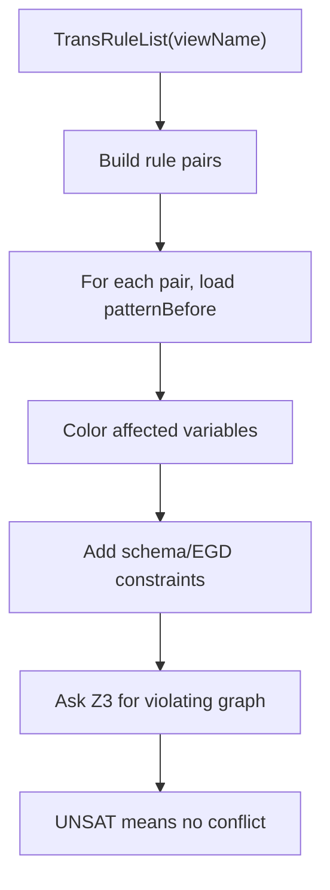
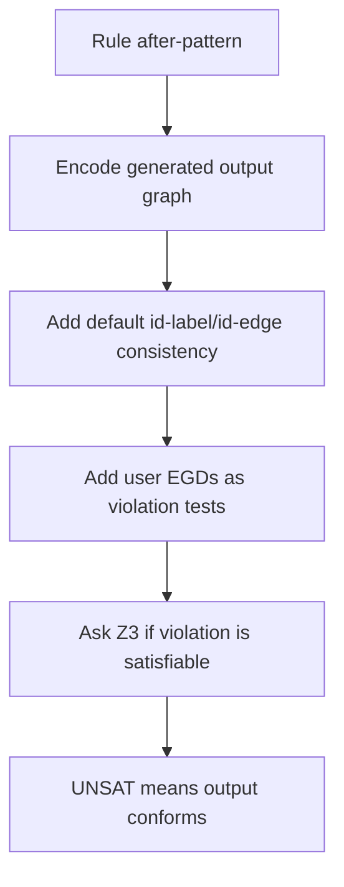

# Guide 7: Type Checking, Constraints, and Well-Behaved Views

This manual explains the constraint and type-checking architecture behind pg-view transformation views. A well-behaved transformation view should not map and delete the same input object in incompatible ways, and its output should respect the graph schema and equality constraints.

Primary source files:

- `src/main/java/edu/upenn/cis/db/graphtrans/typechecker/RuleOverlapCheck.java`
- `src/main/java/edu/upenn/cis/db/graphtrans/typechecker/OutputViewCheck.java`
- `src/main/java/edu/upenn/cis/db/graphtrans/typechecker/SMTConstraint.java`
- `src/main/java/edu/upenn/cis/db/graphtrans/typechecker/InputTypeCheckPruner.java`
- `src/main/java/edu/upenn/cis/db/graphtrans/typechecker/RuleOverlapCheckPruner.java`
- `src/main/java/edu/upenn/cis/db/graphtrans/typechecker/RuleOverlapCheckSimplePruner.java`
- `src/main/java/edu/upenn/cis/db/graphtrans/parser/EgdParser.java`
- `src/main/java/edu/upenn/cis/db/graphtrans/datastructure/Egd.java`
- `src/main/java/edu/upenn/cis/db/Z3Solver/Z3SMTSolver.java`

## 1. What the Checks Prove

Transformation views introduce two operations that ordinary GQL views do not emphasize:

- `MAP FROM ... TO ...`, which says input graph objects are represented by output graph objects.
- `DELETE ...`, which prevents input objects from being copied by the default rule.

Because a view is a union of transformation rules, two rules can overlap on the same input object. A view becomes ambiguous if one rule deletes an object while another maps it, or if two mapping effects imply an output graph that violates schema constraints.

The implementation separates this into two checks:

1. Static conflict checking: prove that no graph satisfying the schema can cause two transformation rules to apply incompatible mappings to the same source node or edge.
2. Output compliance checking: verify that generated output patterns still satisfy schema/EGD constraints.

The code mirrors that structure through `RuleOverlapCheck.check(viewName)` and `OutputViewCheck.check(viewName)`.

## 2. Where Checks Run

`CommandExecutor.createView` performs validation before compiling and installing a non-loaded view:

```java
GraphTransServer.addTransRuleList(transRuleList);

if (isLoad == false && checkRuleValidity(transRuleList.getViewName()) == false) {
    return;
}
```

`checkRuleValidity` runs:

```java
RuleOverlapCheck.check(viewName);
OutputViewCheck.check(viewName);
```

and records timing/status through `Performance.addTypeCheck`.

This means parser output must already be available in `GraphTransServer` before checks run. The type checker reads the same `TransRuleList` objects that `ViewRule` later compiles.

## 3. Constraint Input: EGDs

Users add graph constraints with:

```gql
add constraint N(a,"Person"),N(b,"Person"),NP(a,"id",x),NP(b,"id",x) -> a=b;
```

The grammar rule is `egd_formula` in `GraphTransQuery.g4`. `CommandParser.visitEgd_formula` passes the string to `CommandExecutor.addEgd`, which:

- inserts the escaped EGD string into the `EGD` catalog relation;
- parses it with `EgdParser.Parse`;
- appends the parsed `Egd` to `GraphTransServer.getEgdList()`.

`EgdParser` supports LHS atoms over:

```text
N(var, labelOrVar)
E(edge, src, dst, labelOrVar)
NP(node, "key", "value")
EP(edge, "key", "value")
```

and RHS equality atoms. `Egd` stores `lhs` and `rhs` atom lists for later translation to Z3 constraints.

## 4. Rule Pattern Inputs

The type checker depends on derived fields in `TransRule`:

| Field | Used for |
| --- | --- |
| `patternBefore` | The input pattern graph for a rule. |
| `patternAffected` | Objects affected by map/delete operations. |
| `patternAfter` | Output-side affected pattern. |
| `patternAfterForIndexing` | Expanded after-pattern used by SSR/index code. |
| `affectedVariables` | Variables colored as potentially remapped/deleted. |
| `nodeVarsToDelete`, `edgeVarsToDelete` | Explicit delete variables. |
| `mapFromToMap` | Source-to-target mapping intent. |

`TransRuleParser` fills match/construct/delete/map/skolem fields. `TransRule.computePatterns()` derives affected and after-pattern structures. If a parser change modifies mapping or delete semantics, `computePatterns()` and the type checker must be reviewed together.

## 5. SMT Encoding

Both main checks use Microsoft Z3. `SMTConstraint` provides shared label encoding:

- labels are mapped to integer ids;
- max node/edge/label ids are tracked;
- diagnostic rule/EGD sets can be accumulated.

`RuleOverlapCheck` and `OutputViewCheck` create Z3 contexts, fixedpoint engines, and relation declarations for graph atoms:

```text
N(node, label)
E(edge, src, dst, label)
NP(node, key, value)
EP(edge, key, value)
```

`RuleOverlapCheck` additionally declares:

```text
NCOLOR(node)
ECOLOR(edge)
```

These color relations represent objects that participate in non-identity transformation effects. The implementation reduces mapped/deleted-object conflicts to overlap checks over colored node/edge ids.

## 6. Default EGDs

Both checks add built-in consistency constraints before user EGDs:

- If two `N` facts share a node id, they must share the same label.
- If two `E` facts share an edge id, they must share source, target, and label.

In code this appears as `addDefaultEgds()` in both `RuleOverlapCheck` and `OutputViewCheck`. These defaults prevent impossible canonical graphs during SMT search.

## 7. RuleOverlapCheck

`RuleOverlapCheck.check(viewName)` asks whether any pair of transformation rules can overlap on affected source objects in a way that creates a conflict.

High-level flow:



Important implementation points:

- It checks pairs of rules, and a rule against itself.
- It builds a symbolic graph from the two rules' `patternBefore` atoms.
- It uses `affectedVariables` to determine which symbolic nodes/edges can conflict.
- It adds user EGDs from `GraphTransServer.getEgdList()`.
- The check accepts when the violation formula is unsatisfiable.

The class has pruning-related state such as `ruleEgdsMap` and `newRulePairsList`. If `Config.isTypeCheckPruningEnabled()` is enabled, the pruner classes can reduce the rule/EGD pairs that need full SMT checks.

## 8. OutputViewCheck

`OutputViewCheck.check(viewName)` checks whether output patterns can violate constraints.

The key difference from `RuleOverlapCheck` is that output checking has before and after relations:

```text
N, E, NP, EP
N1, E1
```

`isBefore` controls whether an EGD is encoded as an input assumption or as an output violation query. For output-side checks, an EGD becomes an existential violation: find an output instance where the LHS holds and the RHS equality does not.

High-level flow:



This check is runtime-independent: it reasons over symbolic rule patterns, not the actual graph instance.

## 9. Pruning Classes

The type-checking package contains several pruners:

- `InputTypeCheckPruner`
- `RulePruner`
- `RuleOverlapCheckPruner`
- `RuleOverlapCheckSimplePruner`

These classes are intended to reduce the number of expensive SMT checks by using schema and rule shape information. Configuration flags live in `Config`:

```java
typeCheckEnabled
typeCheckPruningEnabled
useTypeCheckSimplePruner
```

The console exposes:

```gql
option typecheck on;
option prunetypecheck on;
```

Note that `Client.main` currently disables type checking by default for the interactive console, while experiment code explicitly re-enables it in `ExpStarterSecond.runRules`.

## 10. Practical Debugging

Useful symptoms and likely causes:

- `RULES CONFLICT`: `RuleOverlapCheck` found a satisfiable conflict pattern. Inspect `patternBefore`, `affectedVariables`, `MAP`, and `DELETE` clauses.
- `OUTPUT SCHEMA IS NOT SATISFIED`: `OutputViewCheck` found an EGD/schema violation in the generated output pattern.
- Z3 crashes or missing class errors: the local `com.microsoft:z3:4.8.7` dependency is not installed or native Z3 libraries are unavailable.
- Unexpected pass/fail after parser changes: inspect `TransRule.computePatterns()` first. Type checking depends on its derived affected/after patterns.

For maintainers, the important invariant is: parser output, Datalog compilation, and type-checking patterns must agree on which variables are existing input objects, newly constructed objects, mapped objects, and deleted objects.
