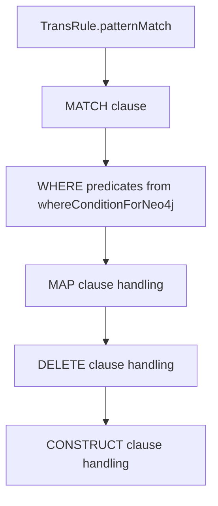

# Guide 8: Graph DBMS Execution, Materialization, and Maintenance

This manual documents the graph-DBMS execution path: how pg-view targets Neo4j/Cypher, why virtual views are hard in graph DBMSs, and how materialized, hybrid, and overlay-style execution are represented in code.

Primary source files:

- `src/main/java/edu/upenn/cis/db/graphtrans/store/neo4j/Neo4jStore.java`
- `src/main/java/edu/upenn/cis/db/Neo4j/Neo4jServerThread.java`
- `src/main/java/edu/upenn/cis/db/graphtrans/graphdb/neo4j/TranslatorToCypher.java`
- `src/main/java/edu/upenn/cis/db/graphtrans/graphdb/neo4j/QueryToCypherParser.java`
- `src/main/java/edu/upenn/cis/db/graphtrans/graphdb/neo4j/UpdatedViewNeo4jGraph.java`
- `src/main/java/edu/upenn/cis/db/graphtrans/graphdb/neo4j/OverlayViewNeo4jGraph.java`
- `src/main/java/edu/upenn/cis/db/graphtrans/store/postgres/PostgresStore.java`
- `src/main/java/edu/upenn/cis/db/graphtrans/store/logicblox/LogicBloxStore.java`

## 1. Implementation Strategies

pg-view supports both relational/Datalog and graph-native implementation strategies.

Relational/Datalog backends can represent views as IDB rules and unfold virtual views at query time. Existing graph DBMSs generally do not expose this same rule-unfolding layer, so graph views need to be represented as materialized graph state or as metadata on the base graph.

The graph-DBMS path uses two main approaches:

1. Update in place: mutate the graph by merging, deleting, and creating nodes/edges.
2. Overlay/versioning: keep a single augmented graph and use metadata such as created/deleted markers to emulate views.

The repository contains both active and older implementations of these ideas.

## 2. Store-Level Neo4j Path

`Neo4jStore` is the active `Store` implementation for platform `n4`.

Important behavior:

- `connect()` only supports embedded Neo4j (`neo4j.embedded = true`).
- `useDatabase()` starts `Neo4jServerThread` for the community `neo4j` database.
- `addTuple()` supports only base `N_g` and `E_g` inserts, adding nodes and edges to Neo4j.
- `createView(DatalogProgram, TransRuleList)` calls `TranslatorToCypher.getCypherForCreateView` and executes the generated Cypher.
- `getQueryResult(String)` calls `TranslatorToCypher.getCypherForQuery` and executes the generated Cypher.
- Datalog-style `getQueryResult(List<DatalogClause>)` is not implemented for Neo4j.

This means Neo4j is not part of the Datalog unfolding path. It is a separate query translation path.

## 3. View Mode Selection

`TranslatorToCypher.getCypherForCreateView` maps pg-view view types to Neo4j modes:

| pg-view type | Neo4j mode | Meaning |
| --- | --- | --- |
| `materialized` | `COPY_AND_UPDATE` | Clone/copy matching subgraphs and update the copy. |
| `hybrid` | `UPDATE_IN_PLACE` | Mutate the graph in place for default-map transformations. |
| `virtual` | `OVERLAY` | Mark or augment graph elements to emulate view membership. |

The method records:

```java
viewNameToModeMap.put(viewName, neo4jViewMode);
viewNameToIsDefaultRuleMap.put(viewName, trList.isDefaultMap());
```

These maps are later used by query translation so a query with `FROM v` can add the right view predicates.

There are implementation guardrails:

- `COPY_AND_UPDATE` with default map currently returns no Cypher rules.
- `UPDATE_IN_PLACE` without default map currently returns no Cypher rules.

Those branches reflect partial support, not a language restriction.

## 4. Cypher Generation for CREATE VIEW

For each `TransRule`, `TranslatorToCypher` emits Cypher clauses that roughly correspond to the rule:



### Match

`handleMatchClause` converts `N`/`E` pattern atoms to Cypher graph patterns:

```cypher
MATCH (a:Label)-[e:EDGE]->(b:Label)
WHERE ...
```

Negated edges are converted to `NOT (...)` predicates and appended to the `WHERE` list.

### Map

For `UPDATE_IN_PLACE`, `handleMapClauseInUpdateInPlace` uses APOC:

```cypher
CALL apoc.refactor.mergeNodes(_m, {properties: "combine"}) YIELD node
CALL apoc.create.setLabels(m, ["MergedLabel"]) YIELD node
```

For `OVERLAY`, `handleMapClauseInOverlay` creates a replacement node with metadata and rewires incident relationships by creating replacement edges while marking source nodes/edges deleted.

### Delete

For `UPDATE_IN_PLACE`, delete uses:

```cypher
DETACH DELETE ...
```

For overlay mode, delete marks graph objects:

```cypher
SET x.d = 1
```

### Construct

`handleConstructClause` creates new nodes and edges for constructed atoms not already present in the match:

```cypher
CREATE (n:Label {c:1, d:99})
CREATE (src)-[e:Label {c:1, d:99}]->(dst)
```

The `c` and `d` properties act as creation/deletion metadata in overlay mode.

## 5. Query Translation

Neo4j query execution does not use `QueryParser` -> Datalog -> `Rewriter`. Instead:

```java
TranslatorToCypher.getCypherForQuery(query)
```

delegates to `QueryToCypherParser`.

The query translator knows the view mode maps populated during view creation. For graph-DBMS execution, a `FROM view` query is translated to Cypher with additional predicates over view metadata, rather than unfolded through Datalog rules.

This distinction is important:

- LogicBlox/PostgreSQL/DuckDB answer virtual views by rule rewriting.
- Neo4j answers graph-native views through generated Cypher over materialized or metadata-annotated graph state.

## 6. Older Neo4jGraph Implementations

The package also contains older or parallel implementations:

- `Neo4jGraph` interface
- `UpdatedViewNeo4jGraph`
- `OverlayViewNeo4jGraph`
- `Translator`
- `UpdateInPlaceTranslatorHandler`
- `OverlayTranslatorHandler`

`UpdatedViewNeo4jGraph` and `OverlayViewNeo4jGraph` contain detailed Cypher construction logic and are useful references for update-in-place and overlay behavior. However, `Neo4jStore.createView` currently uses `TranslatorToCypher`, not these classes.

`Translator` and handler classes are mostly stubs and should not be treated as the active execution path.

## 7. Relational Materialization

Relational stores use the Datalog program generated by `ViewRule`.

`PostgresStore.createView` groups clauses by head relation and emits:

```sql
CREATE VIEW relation AS (...)
```

or:

```sql
CREATE MATERIALIZED VIEW relation AS (...)
```

depending on whether the head relation is marked as an EDB/materialized relation in `DatalogProgram`.

`DuckDBStore.createView` emits either:

```sql
CREATE VIEW ...
```

or:

```sql
CREATE TABLE ... AS (...)
```

`LogicBloxStore` installs Datalog blocks/rules directly. This is the native Datalog backend strategy.

## 8. Incremental Maintenance

The implementation has several maintenance-related hooks:

- `Config.useIVM`
- `Config.setUseIVM`
- `PostgresStore.createView` branches guarded by `Config.isUseIVM()`
- trigger generation for SSR maintenance on `e_g`
- commented/custom procedure support in `OverlayViewNeo4jGraph.handleIVM`
- LogicBlox constructor/materialization support through `createConstructors`

The PostgreSQL IVM branch can create tables instead of views and generate PL/pgSQL trigger functions such as `process_ssr_edge_insertion`. This is experimental code. It is useful as a starting point for maintenance research, but not a general-purpose, fully validated IVM subsystem.

## 9. Practical Backend Differences

| Concern | Relational/Datalog path | Neo4j path |
| --- | --- | --- |
| Virtual views | Supported by Datalog unfolding. | Not supported directly; emulated through overlay metadata. |
| Materialized views | SQL views/materialized views or LogicBlox predicates. | Graph mutations or clone/overlay Cypher. |
| Query execution | `QueryParser` -> `Rewriter` -> `Store.getQueryResult(List<DatalogClause>)`. | `QueryToCypherParser` -> Cypher execution. |
| Indexes | SQL indexes, SSR relations, Datalog EDB metadata. | Neo4j indexes created on `uid` for labels/edge labels. |
| Maintenance | Experimental triggers/LogicBlox behavior. | Expensive graph updates or overlay rewrites. |

## 10. Developer Guidance

When changing Neo4j behavior:

- Start with `TranslatorToCypher`, because it is what `Neo4jStore` calls.
- Keep view mode maps synchronized with query translation.
- Test each view type separately; unsupported combinations currently return empty Cypher rule lists.
- Be careful with APOC usage. Many transformations depend on `apoc.periodic.iterate`, `apoc.refactor.mergeNodes`, and `apoc.create.relationship`.
- Do not assume Datalog relation names exist in Neo4j. The graph backend operates over labels, relationships, and metadata properties.

When changing materialization behavior in SQL stores:

- Inspect `DatalogProgram.getEDBs()` and `populateEDBs` in `CommandExecutor`.
- Check `PostgresStore.createView` grouping by head relation.
- Review `Config.isUseIVM()` branches before changing SSR/materialized behavior.
