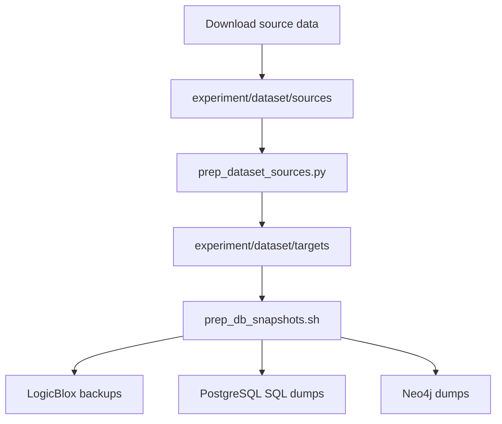

# Guide 9: Experiments, Datasets, and Workloads

This manual documents the experimental architecture used to run pg-view workloads. The experiment system is a command generator: it reads JSON workload descriptions, expands them into pg-view console commands, prepares DB snapshots, runs the commands against selected platforms and view types, and logs timing/performance data.

Primary source files and scripts:

- `src/main/java/edu/upenn/cis/db/graphtrans/experiment/ExpStarterSecond.java`
- `src/main/java/edu/upenn/cis/db/graphtrans/experiment/ExpConfigLoader.java`
- `src/main/java/edu/upenn/cis/db/graphtrans/experiment/ExpConfig.java`
- `src/main/java/edu/upenn/cis/db/helper/Performance.java`
- `experiment/run.sh`
- `experiment/setup.sh`
- `experiment/prep_dataset_sources.py`
- `experiment/prep_db_snapshots.sh`
- `experiment/get_exp_result.py`
- `experiment/workload/*.json`
- `docs/workload.md`
- `docs/datasets.md`

## 1. Workload Coverage

The workload suite evaluates:

- standard GQL/G-CORE-style views;
- transformation views with default rules;
- materialized, hybrid, virtual, and SSR-backed execution;
- LogicBlox, PostgreSQL, and Neo4j;
- view creation, query execution, SSR rewriting, and update/maintenance behavior.

Datasets:

| Dataset | Domain | Workload role |
| --- | --- | --- |
| `lsqb` | LDBC subgraph benchmark | Standard graph pattern views. |
| `prov` | Wikipedia provenance graph | Subgraph substitution / zooming. |
| `oag` | Open Academic Graph | Added derived author/venue/coauthor edges. |
| `soc` | Twitter/social graph | Friend recommendation edges. |
| `word` | WordNet knowledge graph | Node collapse / abstraction. |

The canonical human-readable workload descriptions are in `docs/workload.md`.

## 2. Dataset Preparation Pipeline

`docs/datasets.md` and `experiment/setup.sh` describe the data preparation pipeline:



`prep_dataset_sources.py` delegates dataset-specific conversion to `experiment/datasetlib/*`. Target files are normalized into node and edge CSVs compatible with the base graph relations:

```text
N_g(id, label)
E_g(id, from, to, label)
```

`prep_db_snapshots.sh` then creates backend-specific snapshots:

- LogicBlox workspace exports under `experiment/dataset/snapshots/logicblox`.
- PostgreSQL SQL dumps under `experiment/dataset/snapshots/postgres`.
- Neo4j database dumps under `experiment/dataset/snapshots/neo4j`.

The runtime experiment path uses snapshots through the console command:

```gql
prepare from "prov" on pg;
```

which dispatches to `CommandExecutor.prepareDatabase`.

## 3. Workload JSON Structure

The top-level generated config is `experiment/workload/workload.json`, built from `workload.json.template` by `experiment/run.sh`.

Important fields:

```json
{
  "configFilePath": "conf/graphview.conf",
  "testmode": false,
  "printRules": true,
  "printTiming": false,
  "printConsole": true,
  "expIteration": 1,
  "platforms": ["lb"],
  "viewtypes": ["ssr"],
  "constraints": ["..."],
  "datasets": ["test", "soc", "prov", "oag", "word", "lsqb"],
  "datasets_execute": [false, false, true, false, false, false]
}
```

Dataset-specific files such as `experiment/workload/prov.json` contain:

- `schema.nodes`
- `schema.edges`
- dataset-specific `constraints`
- `workload` entries with names, views, and queries
- `testset` nodes and edges for small test mode

`ExpConfigLoader.load` reads the top-level config, then calls `loadDataset` for every dataset marked true in `datasets_execute`.

## 4. Command Generation

`ExpStarterSecond.execute(viewIndex, dataset)` expands a workload into console commands.

Generated command phases:

1. Options:

```gql
option typecheck off;
option prunetypecheck on;
option prunequery off;
```

2. Database setup:

```gql
prepare from "prov" on pg;
connect pg;
use exp;
```

3. Schema:

```gql
create node E;
create edge DERBY (E -> E);
```

4. Constraints:

```gql
add constraint ...;
```

5. Optional test data:

```gql
insert N (...);
insert E (...);
```

6. Views:

The workload JSON uses `CREATE VIEW`; the runner rewrites it based on `option_viewtype`:

| `viewtype` option | Emitted view type |
| --- | --- |
| `mv` | `CREATE materialized VIEW` |
| `hv` | `CREATE hybrid VIEW` |
| `vv` | `CREATE virtual VIEW` |
| `ssr` | Creates virtual view text, then adds `create ssr on <lastView>` |

7. Queries:

The JSON query strings are sent directly to `CommandExecutor.run`.

8. Cleanup:

```gql
drop exp;
disconnect;
```

## 5. Experiment Runner

`experiment/run.sh` is the standard wrapper:

```bash
./run.sh -i 1 -p lb -v mv -d word
```

It:

1. substitutes command-line values into `workload/workload.json.template`;
2. enables exactly one dataset flag;
3. runs `mvn exec:java@exp` from the repository root.

`ExpStarterSecond.main` then loops over:

- experiment iterations;
- platforms;
- view types;
- enabled datasets;
- workload entries for each dataset.

Each workload run calls `execute`.

## 6. Performance Logging

`Performance` collects timings and metadata across command execution. The main events recorded by the code include:

- loading time;
- type-check time;
- view build time;
- index build time;
- query time;
- query result cardinality;
- platform, view type, graph/workload name;
- schema and EGD sizes.

`ExpStarterSecond.runRules` calls:

```java
Performance.setup(option_graph, option_graph + " workload");
...
Performance.setPlatform(Config.getPlatform());
Performance.setViewType(option_viewtype);
Performance.logPerformance();
```

`Client.main` also logs performance after interactive script execution.

Result post-processing is handled by `experiment/get_exp_result.py`, which converts experiment logs into CSV summaries.

## 7. Platform Preparation

`CommandExecutor.prepareDatabase` dispatches by platform:

| Platform | Snapshot action |
| --- | --- |
| `n4` | Load Neo4j dump from `experiment/dataset/snapshots/neo4j/<dataset>/neo4j.db`. |
| `pg` | Restore PostgreSQL SQL snapshot from `experiment/dataset/snapshots/postgres/<dataset>.sql`. |
| `lb` | Load LogicBlox backup from `experiment/dataset/snapshots/logicblox/<dataset>`. |

This separates expensive dataset import from repeated experiment runs.

## 8. Workload Semantics

The workloads exercise several architectural cases:

- LSQB: standard conjunctive graph views without default-map transformation.
- PROV: replacement of event-log/provenance structures with higher-level PROV-like subgraphs.
- OAG: derived edges such as coauthor and publication venue.
- SOC: derived recommendation edges using negated edge predicates.
- WORD: abstraction and collapse of knowledge-graph structures.

The workloads intentionally vary:

- number of node variables;
- number of edge variables/steps;
- use of negation;
- use of generated Skolem ids;
- whether queries can be answered by one or more SSRs.

`docs/workload.md` is the best place to read the actual view/query text.

## 9. Adding a New Dataset or Workload

To add a dataset:

1. Add source conversion logic under `experiment/datasetlib` or `prep_dataset_sources.py`.
2. Produce target node/edge CSVs under `experiment/dataset/targets/<dataset>`.
3. Add snapshot generation support if paths differ from existing conventions.
4. Add `experiment/workload/<dataset>.json`.
5. Add the dataset name to `workload.json.template`.
6. Update `docs/workload.md` and `docs/datasets.md`.

To add a workload for an existing dataset:

1. Add a new object under `workload` in the dataset JSON.
2. Include `name`, `views`, and `queries`.
3. Ensure view names are unique within a run or account for cleanup.
4. Include constraints needed by type checking.
5. Test with `testmode: true` and the `testset` first.

## 10. Practical Caveats

- `experiment/workload/workload.json` allows comments and is parsed by stripping lines starting with `//`; it is not strict JSON.
- Some scripts assume Linux paths and tools.
- `setup.sh` downloads external datasets and installs packages; it is not suitable for a restricted/offline environment without modification.
- Neo4j and LogicBlox snapshot paths depend on `conf/graphview.conf`.
- `run.sh` currently enables one dataset per invocation.
- The `ssr` view type in experiment config is not a grammar-level view type; it is a runner convention that creates SSR after view creation.
