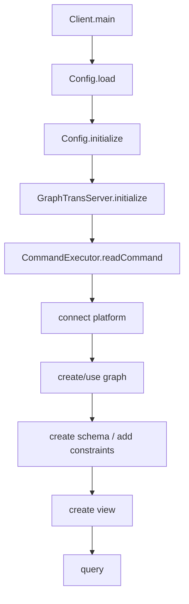

# Guide 10: Catalog and Runtime State

This manual documents how pg-view stores runtime metadata: active views, schema labels, EGDs, indexes, Datalog rules, and backend stores. The code splits this metadata between persistent catalog relations and in-memory singleton state.

Primary source files:

- `src/main/java/edu/upenn/cis/db/graphtrans/GraphTransServer.java`
- `src/main/java/edu/upenn/cis/db/graphtrans/Config.java`
- `src/main/java/edu/upenn/cis/db/graphtrans/catalog/Catalog.java`
- `src/main/java/edu/upenn/cis/db/graphtrans/catalog/Schema.java`
- `src/main/java/edu/upenn/cis/db/graphtrans/catalog/SchemaNode.java`
- `src/main/java/edu/upenn/cis/db/graphtrans/catalog/SchemaEdge.java`
- `src/main/java/edu/upenn/cis/db/graphtrans/catalog/ViewCatalog.java`
- `src/main/java/edu/upenn/cis/db/graphtrans/graphdb/datalog/BaseRuleGen.java`
- `src/main/java/edu/upenn/cis/db/graphtrans/CommandExecutor.java`

## 1. Two Kinds of State

pg-view has two metadata layers:

1. Persistent catalog relations in the active store.
2. In-memory Java state used by parsers, compilers, rewriters, and experiments.

Persistent catalog relations are created by `BaseRuleGen.addSchemaRule`:

```text
N_schema(label)
E_schema(from, to, label)
EGD(constraint)
CATALOG_VIEW(name, base, type, rule, level)
CATALOG_INDEX(viewname, type, label)
CATALOG_SINDEX(viewname, query)
```

In-memory state lives mostly in static classes:

- `GraphTransServer`
- `Config`
- `Schema`
- `Performance`

This design is simple for a single console session, but it means tests and experiments must reinitialize static state carefully.

## 2. GraphTransServer

`GraphTransServer` is the main runtime registry.

Important fields:

| Field | Meaning |
| --- | --- |
| `transRuleListList` | Ordered list of created views. |
| `transRuleLists` | Map from view name to `TransRuleList`. |
| `egdList` | Parsed EGDs active in the current graph. |
| `program` | Global `DatalogProgram` containing generated view rules. |
| `indexList` | Catalog-style labels for simple indexes. |
| `sIndexMap` | String-index query metadata. |
| `indexes` | Additional Datalog index rules. |
| `store` | Optional global store, mostly unused in the command path. |
| `baseStore` | Simple Datalog store used by canonical-database operations. |

`GraphTransServer.initialize()` creates a fresh `DatalogProgram`, clears registries, and initializes `baseStore` as a connected `SimpleDatalogStore`.

`baseStore` is important for SSR substitution and coveredness-style checks because those algorithms need a small canonical database independent of the primary backend.

## 3. Config

`Config` contains three categories of state:

1. Names and predicate constants:

```text
relname_node = N
relname_edge = E
relname_nodeprop = NP
relname_edgeprop = EP
relname_mapping = MAP
relname_default_mapping = DMAP
relname_gennewid = GENNEWID
relname_base_postfix = _g
```

2. Runtime flags:

```text
typeCheckEnabled
typeCheckPruningEnabled
subQueryPruningEnabled
useQuerySubQueryInPostgres
useIVM
useSimpleDatalogEngine
answerEnabled
```

3. Backend and mapping configuration:

```text
platform
workspace
config map loaded from graphview.conf
schemaMapping
```

`Config.load` reads INI settings from `conf/graphview.conf`. `Config.initialize` creates shared `Predicate` instances such as `predN`, `predE`, `predNP`, `predEP`, interpreted comparison predicates, and `predSimEdge`.

Any new relation family should be added here if it is part of the graph-view compiler's naming convention.

## 4. Schema

`Schema` stores the active graph schema in memory:

```java
ArrayList<SchemaNode> schemaNodes;
ArrayList<SchemaEdge> schemaEdges;
HashMap<String, Integer> mapNode;
HashMap<Triple<String,String,String>, Integer> mapEdge;
```

`CommandExecutor.addSchemaNode` and `addSchemaEdge` update both:

- the persistent catalog relation (`N_schema` or `E_schema`) unless loading;
- the in-memory `Schema`.

The type checker and experiment reporting use `Schema` to understand available labels and schema size. `Schema.clear()` is called during graph creation and catalog load.

## 5. Catalog Loading

`Catalog.load(store)` reconstructs in-memory state from persistent catalog relations:

1. `Schema.clear()`
2. clear active EGDs
3. `loadViewCatalog`
4. parse each stored view with `ViewParser`
5. call `CommandExecutor.createView(true, createViewQuery, transRuleList)`
6. `loadEgdList`
7. `loadIndexList`
8. `loadSIndexList`
9. `loadSchemaNode`
10. `loadSchemaEdge`

There is an important implementation note: `CommandExecutor.useGraph` currently has `Catalog.load(store)` commented out. So in the interactive path, existing catalog metadata may not be automatically reloaded when switching to a graph. If persistent catalog behavior matters, inspect and restore that path deliberately.

## 6. ViewCatalog

`ViewCatalog` is a small value object:

```java
viewName
baseName
type
query
level
```

`Catalog.loadViewCatalog` queries `CATALOG_VIEW` and constructs these objects. `ViewRule.insertCatalogView` exists to insert view metadata, though current create-view code primarily keeps `TransRuleList` in memory and store-specific behavior varies.

The `level` field represents view nesting depth: base graph `g` is level 0, views over `g` are level 1, and views over views increment from there. Some code currently approximates this with `GraphTransServer.getNumOfTransRuleListList()`.

## 7. DatalogProgram Runtime State

`GraphTransServer.getProgram()` is the global logical program. It receives rules from:

- `ViewRule.addViewRuleToProgram`
- SSR generation
- possible Datalog parser utilities

Important contents:

- rules grouped by head relation;
- EDB relation names;
- UDF relation names;
- index metadata;
- constructor metadata for LogicBlox;
- created-view position used by stores to avoid recreating old rules.

Query rewriting reads this program. Stores read this program when creating views. If program state is stale, query rewriting will fail with missing rules or produce old definitions.

## 8. Store State

There are three store references to distinguish:

1. `CommandExecutor.store`: the active user-selected backend.
2. `CommandExecutor.storeLB`: optional internal LogicBlox store when platform is `lb`.
3. `GraphTransServer.baseStore`: simple Datalog store for canonical databases and SSR query rewriting.

`CommandExecutor.connect(platform)` creates the active store via `StoreFactory`. `GraphTransServer.initialize()` initializes only the base store and program registry.

Do not assume `GraphTransServer.getStore()` is the active command store; the command path uses `CommandExecutor.store`.

## 9. Lifecycle of a Console Session

Typical sequence:



`create graph` calls `BaseRuleGen.addRule` and asks the active store to create base and catalog relations.

`create view` adds a `TransRuleList` to `GraphTransServer`, optionally type-checks it, populates the global Datalog program, and asks the store to create backend objects.

`query` parses a query, uses `GraphTransServer.getProgram()` for rewriting, and executes against the active store.

## 10. Adding New Metadata

When adding a new architectural feature, decide whether metadata is:

- session-only, in which case `GraphTransServer` may be enough;
- persistent per graph, in which case add a catalog relation in `BaseRuleGen`, load logic in `Catalog`, and insert logic in the relevant command;
- backend-specific, in which case the store may need its own metadata table or generated DDL.

Examples:

- Semantic-join index metadata should probably be persistent, because query rewriting needs to know which semantic edge predicates are covered after reconnecting to a graph.
- A temporary canonical database for query rewriting should remain session-only in `baseStore`.
- A debug flag belongs in `Config`, not the persistent catalog.

## 11. Common Pitfalls

- Static state persists across tests unless `Config.initialize` and `GraphTransServer.initialize` are called.
- `Schema.clear` does not clear `GraphTransServer.getProgram()`.
- `Catalog.load` can recreate views and mutate the global Datalog program.
- `use graph` currently does not reload catalog metadata by default.
- Store-created physical views may outlive Java in-memory state if the backend database is reused.
- Relation naming is string-based; a typo in `Config` naming conventions can break rewriting far from the source of the change.

For maintainers, the core rule is: every persistent catalog feature needs a matching in-memory representation and a load path, or it will work only in the session that created it.
